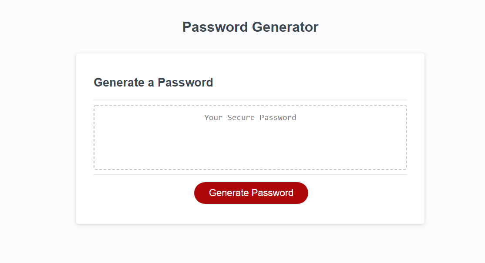

# Password Generator
  
   
  

  ## Description

  In this Password Generator, you will see a red button on the bottom of the screen that says Generate Password. When that button is pushed, you will be presented with a series of prompts. You will first be asked to choose how long you want your password to be, with an option to choose from 8-128 characters. If you choose a number outside of those parameters, you will be looped back to the beginning and asked again. Once you have satisfied that critera, you will be asked another set of values. You will be asked if you want your password to include numbers, symbols, lower case, and upper case characters. If you decide to choose none of those parameters, you will be looped back to the beginning and asked to choose those parameters again. Once you have chosen your character count and you selected characters to include, your password will be generated.

  
  
  ## Table of Contents
  * [Installation](#installation)
  * [Usage](#usage)
  * [Contribution](#contribution)
  * [License](#license)
  ## Installation
  
  App is deployed to git hub pages. Nothing needs to be installed. If you wish to contribute, just clone the repo.
  
  
  ## Usage
  
  Follow the prompts given on the browser. Refer to description for more information.
  
  
  ## Contribution
  
  Anyone can contribute to this project to improve the functionality and UI.
  
  
  ## License
  
  MIT License
  
  
  ## Questions?
  
  If you have any questions, please contact me with the information below:

  Github [@oballematt](https://github.com/oballematt)
  
